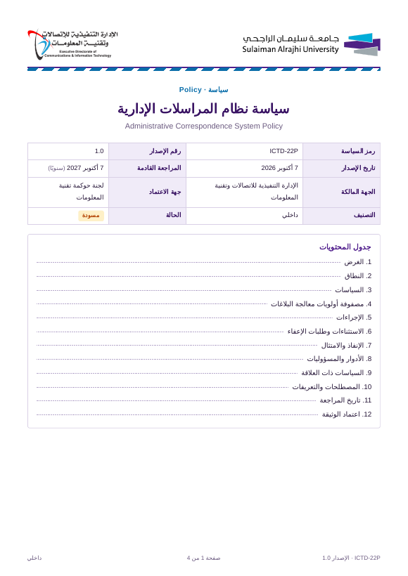

# نموذج إعداد السياسات · ICTD Policy Template — v2.3

**جامعة سليمان الراجحي — الإدارة التنفيذية للاتصالات وتقنية المعلومات**
*Sulaiman Al Rajhi University — Executive Directorate of Communications & Information Technology*

قالب ويب عربي (RTL) لإعداد سياسات تقنية المعلومات وفق الهيكل المعتمد لسياسات الإدارة (ICTD-01P … ICTD-24P)، مع معاينة A4 حية وحفظ مركزي في سجل سياسات على Google Sheets.

*An Arabic RTL web template for authoring ICTD IT policies in the approved structure, with a live A4 preview and a central Google Sheets policy register.*



---

## المحتويات · Contents

| المسار · Path | الوصف · Description |
|---|---|
| `index.html` | القالب (محرر + معاينة A4) · Template |
| `policies.html` | مكتبة السياسات: عرض جميع السياسات وفتحها للعرض أو التعديل · Policy library |
| `config.js` | رابط سجل السياسات وقائمة مالكي السياسات المشتركة بين الصفحتين · Shared register URL & Policy Owner list |
| `policies/` | ملفات JSON للسياسات الأربع والعشرين و`library.js` المجمعة · Bundled policies |
| `apps-script/Code.gs` | خادم سجل السياسات (Google Apps Script) · Register backend |
| `docs/sample-ICTD-22P.pdf` | مثال مطبوع من القالب · Sample output |
| `docs/preview.png` | صورة معاينة · Preview image |
| `docs/sru-logo.png`, `docs/ictd-logo.png`, `docs/itoc-logo.png` | الشعارات (للمرجع فقط، وهي مدمجة في الصفحة) · Source logos |
| `CHANGELOG.md` | سجل التغييرات · Change record |
| `.nojekyll` | لنشر الملفات كما هي على GitHub Pages |

## المزايا · Features

- **هيكل السياسة المعتمد:** الغرض، النطاق، المرجعيات النظامية، السياسات، الإجراءات، الاستثناءات، الإنفاذ والامتثال، الأدوار والمسؤوليات، السياسات ذات العلاقة، المصطلحات، تاريخ المراجعة، اعتماد الوثيقة.
- **ترقيم تلقائي** للأقسام والبنود (3.1، 3.2 …) وجدول المحتويات.
- **فحص اكتمال** قبل الاعتماد (الرمز ICTD-NNP، صيغة الإصدار x.y، الحقول الإلزامية).
- **سجل مركزي:** حفظ تلقائي، فتح أي سياسة أو أي إصدار سابق للتعديل، كشف التعارض، تنبيه بمواعيد المراجعة.
- **استيراد دفعة:** رفع عدة ملفات JSON إلى سجل السياسات مرة واحدة، مع معاينة الحالة وخيار التحديث.
- **إصدار جديد** بنقرة: 1.0 ← 1.1 … 1.9 ← 2.0 مع إضافة صف في «تاريخ المراجعة».
- **التصدير:** طباعة / PDF مع ترقيم الصفحات، Word، JSON.

## النشر على GitHub Pages · Deploy

1. ارفع محتوى هذا المجلد إلى المستودع (مثلًا داخل `ITOC/policy-template-v2.3/`).
2. فعّل **Settings ← Pages** على الفرع الرئيسي.
3. الرابط: `https://<org>.github.io/<repo>/policy-template-v2.3/`

## إعداد سجل السياسات · Register setup (مرة واحدة)

1. افتح جدول **«سجل السياسات - ICTD»** ← **Extensions ← Apps Script**.
2. الصق محتوى `apps-script/Code.gs` واحفظ.
3. شغّل الدالة `setup` ووافق على الصلاحيات (تُنشأ أوراق `Policies` و`Versions` و`Log`).
4. **Deploy ← New deployment ← Web app**:
   - Execute as: **Me**
   - Who has access: **Anyone**
5. ضع الرابط المنتهي بـ `/exec` في الثابت `DEFAULT_API_URL` داخل `index.html` (موجود مسبقًا في v2.3).

> **تحديث الكود لاحقًا:** استخدم **Manage deployments ← Edit ← New version** حتى يبقى الرابط نفسه.

### اختبار الاتصال · Health check
```
<WEB_APP_URL>?action=ping   →   {"ok":true,"version":"v1.2"}
```

## مكتبة السياسات · Policy library

زر **«جميع السياسات»** أعلى القالب يفتح `policies.html` في صفحة جديدة. لكل سياسة زرّا **عرض** و**تعديل**، وتُقرأ من السجل إن كان متاحًا، وإلا من مجلد `policies/`.

روابط مباشرة:
- تعديل: `index.html?code=ICTD-22P`
- عرض فقط: `index.html?code=ICTD-22P&view=1`
- سياسة جديدة: `index.html?new=1`

**الحذف:** زر «حذف» في مكتبة السياسات، ويتطلب كتابة رمز السياسة واسم المستخدم للتأكيد. الحذف آمن: تنتقل السياسة إلى ورقة **Archive** في السجل.
**الاسترجاع (للمسؤول):** من جدول Google Sheets: قائمة **سجل السياسات ← استرجاع سياسة محذوفة…** ثم اكتب الرمز.

**تحديث مكتبة السياسات المرفقة:** بعد اعتماد سياسات جديدة صدّر ملفات JSON واستبدلها في `policies/`، وأعد توليد `library.js` (أو اكتفِ بالسجل متى عمل الاتصال).

## الهوية الموحّدة · Brand kit

الترويسة (شعارا الجامعة والإدارة) والتذييل (شعار ITOC مرتبطًا بمركز النماذج) يأتيان من حزمة الهوية المشتركة في مستودع ITOC:
```html
<script src="https://ictsru.github.io/ITOC/brand/sru-brand.js" data-form-title="نموذج إعداد السياسات · ICTD Policy Template" data-form-version="v2.3" defer></script>
```
عند تحديث الإصدار عدّل `data-form-version` وثابت `APP_VERSION` معًا. وإذا تعذّر تحميل الحزمة يعرض القالب نسخة احتياطية من شعاراته المدمجة.

## إعدادات المسؤول · Admin settings

زر «الإعدادات» مخفي عن المستخدمين. يفتح مسؤول النظام نافذة الإعدادات بالاختصار **Ctrl + Alt + S** لتغيير رابط Web App أو مفتاح الوصول أو اسم المستخدم.

## الأمان · Security

- النشر بصلاحية **Anyone** يعني أن من يملك الرابط يستطيع القراءة والحفظ.
- يُوصى بإضافة **Script property** باسم `API_KEY`، وإدخال القيمة نفسها في «الإعدادات» داخل القالب.
- لا تضع مفتاح `API_KEY` داخل `index.html` في مستودع عام.

## واجهة الخادم · API

| الطلب | الوظيفة |
|---|---|
| `GET ?action=ping` | فحص الاتصال |
| `GET ?action=list` | قائمة السياسات |
| `GET ?action=get&code=ICTD-22P[&version=1.0]` | جلب سياسة أو إصدار محدد |
| `GET ?action=versions&code=ICTD-22P` | إصدارات سياسة |
| `POST {action:"save", data, baseUpdatedAt, force}` | حفظ / تحديث (Content-Type: text/plain) |
| `POST {action:"delete", code, reason, user}` | حذف آمن إلى ورقة Archive |

## الإصدار · Version

**v2.3** — انظر [CHANGELOG.md](CHANGELOG.md).
إعداد: Mohamed ElMahdy, IT Operations Manager, Sulaiman Al Rajhi University
